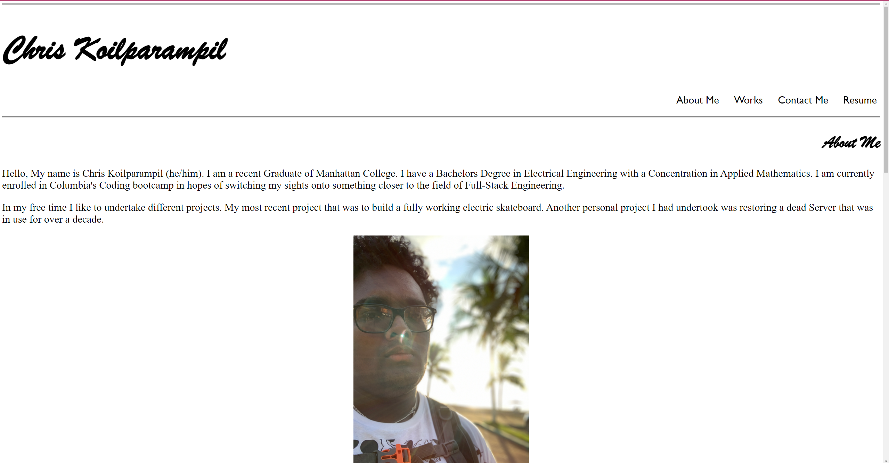

# portfolioDraft

## Description
 A single page front-end application as a class assignment to demonstrate basic HTML and CSS skills. It is a portfolio with minimal CSS for the simple Razzle Dazzle.


## Table Of Contents

-[Deployment](#Deployment)

-[Usage](#Usage)

-[Contributors](#Contributors)

-[Credits](#Credits)

-[License](#License)

-[Testing](#Testing)

## Deployment 

Here are the critical requirements necessary to develop a portfolio.

```
GIVEN I need to sample a potential employee's previous work
WHEN I load their portfolio
THEN I am presented with the developer's name, a recent photo or avatar, and links to sections about them, their work, and how to contact them
WHEN I click one of the links in the navigation
THEN the UI scrolls to the corresponding section
WHEN I click on the link to the section about their work
THEN the UI scrolls to a section with titled images of the developer's applications
WHEN I am presented with the developer's first application
THEN that application's image should be larger in size than the others
WHEN I click on the images of the applications
THEN I am taken to that deployed application
WHEN I resize the page or view the site on various screens and devices
THEN I am presented with a responsive layout that adapts to my viewport
```
The following image shows the web application's appearance and functionality.



The following is a working link to the page I made.

[https://Koilparampil.github.io/portfolioDraft/](https://Koilparampil.github.io/portfolioDraft/)
## Usage 

## Contributors

## Credits


## License


## Testing
